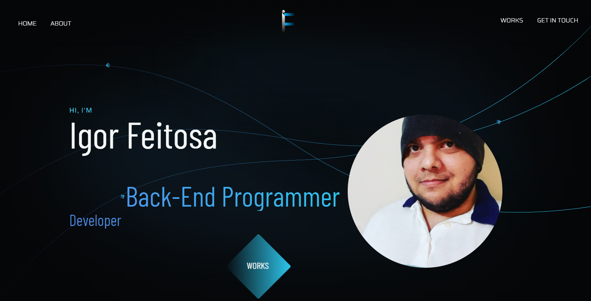

# Portfolio

Personal portfolio developed with the purpose of promoting my work

# How to use the project

### Necessary tools
- Live Sass Compiler
- Live server

## Used Concepts
- DDD Architecture
  
## Dev Tools
- Prettier
- Eslint
- SASS

## Pages

### Landing Page

### Selected Works section

### About Me section

### Get In Touch section

### Footer section

## License

This project is under license.

[⬆ Get to the top](#porfolio) 
